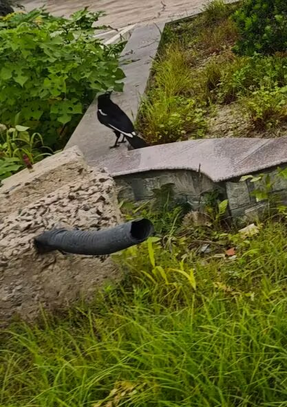
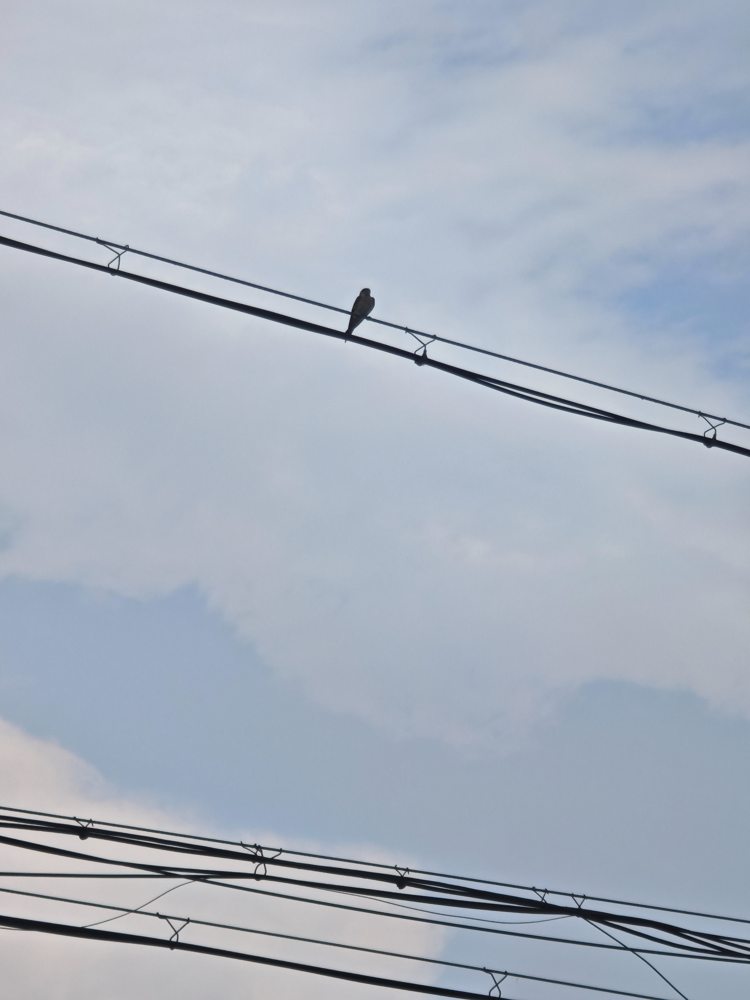
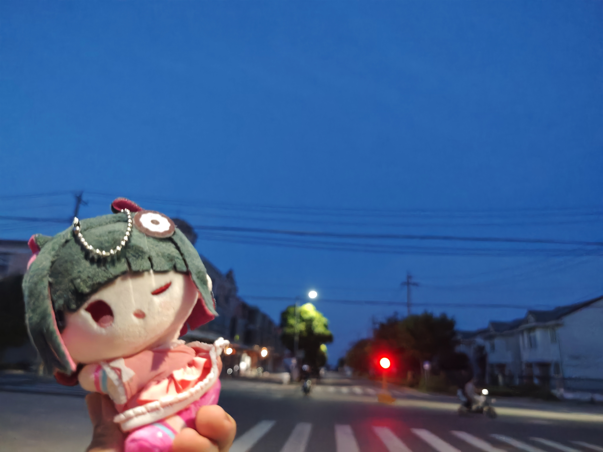
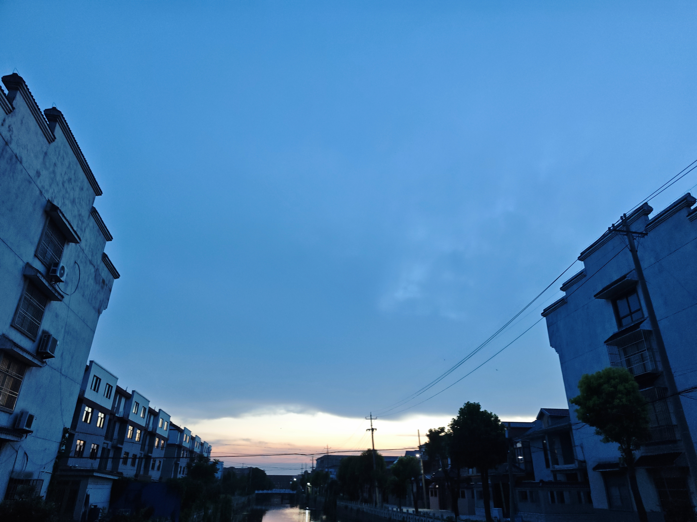
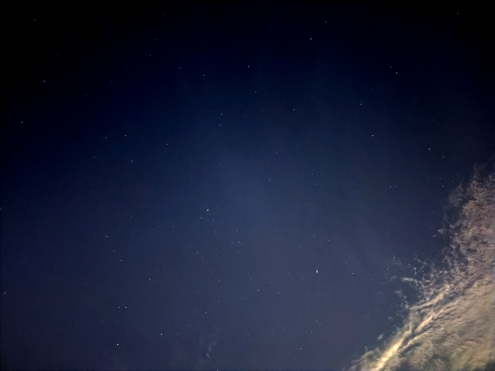
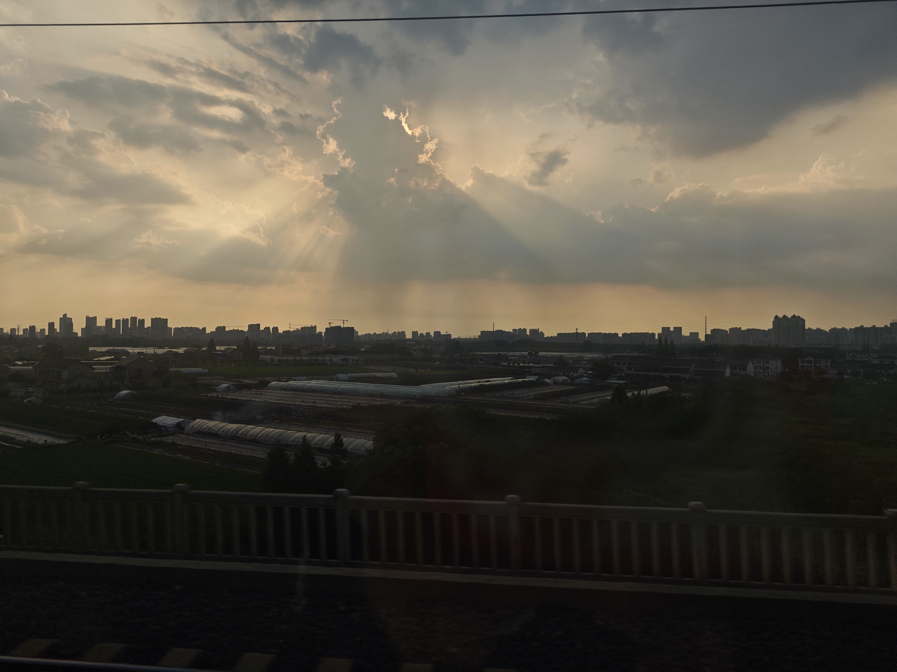
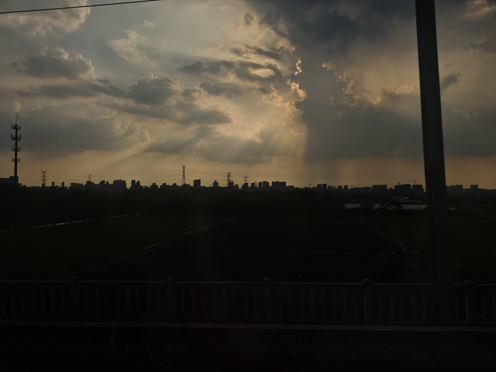

# 回家 一些日记

> 其实写的时候已经是8/1号的晚上了，匆忙到没有时间书写，抑或说是记录一些东西。情感是即时性的东西，难让自己以一模一样的状态沉浸在过去的某个场景里。

## 一
公公婆婆在巷口等。
巷子还是那么窄，院子里丝瓜藤爬上了墙头。幼时广阔的院子如今找不到了。
饭桌上的菜照例堆起来。西瓜有些沙瓤，但是总得吃下去，但是很幸福。

## 二
带着观鸟的一丝喜悦来到乡下。好消息是这里确实没有多少咕咕咕。坏消息是这些鸟都没咕咕咕那么好拍。放张车上拍的鹊子。
插秧的季节。水稻田里有白鹭可以拍，隔着很远的距离。风从河那边过来，带着水和泥土的腥气，是小时候闻惯的味道。
过去的我会坐在电动三轮上，怀着尚未被磨灭的探索欲，听着我的外婆一边开车一边和我讲，这个是毛豆，这个是玉米……
可惜这些记忆逐渐，随着高中回乡的减少，淡去了。现在想起这些事情，不由得有一种悲凉的疏离感。
情怀是知识和某个具体的人绑在一起时有的温度。
当然，现在的知识也很有用，只是它不长在任何一块地里。它跟着我走，去哪个城市都能用，所以哪个城市都不算家。

## 三
巷子上方的电线拉得又低又密，把天空分成一格一格。
喜欢这种漫无目的延展的感觉。在山东读书的同学把各个天气下的一个电线杆都拍了一遍。

## 四
从任何一种效率的眼光看，这里都是落后的。没有外卖，快递点在几公里外。天一黑，街上就没什么人了。
站在这条巷子里，身体里有一部分会自动慢下来，人往前走了很远，总得知道有什么东西留在原地。可以不去想学校，不去想很多效率的东西。原来世界上也有这样的地方，没有效率指标，自洽的一天天地生活着。
仿佛世界角落一般，被外界的繁忙遗忘。关心水稻，关心玉米，关心远方的云。
下午躲在房间里打游戏。放假前给自己排的表——OS一天一课，项目，刷题——在乡下自动作废。打到眼睛发酸，往床上一倒，看着窗外水泥糊的墙，坑坑洼洼。
躺着的时候也会想一些别的事。想不太远的将来，想一些说了也没用、不说又憋着的话。窗外有鸟短促地叫了一声，没有下文。
像很多话一样。

## 五
喜欢天将黑不黑的时候。很深的蓝。没有张扬的阳光灿烂，一切都被柔和的阴郁笼罩，棱角分明被昏暗抹平。同时也不至漆黑一片让人心生孤寂。
天文社已经是初中的事情了。为数不多的记忆只有四季星空，喜欢能帮人解释星空照片的感觉。初中还参加过观星活动，结果差点在深秋的晚上冻个半死，唯一的记忆是那一夜的木星在西边，在老旧的居民楼上，然后缓缓落下。
物语系列似乎提及过有关于夏季大三角的恋爱之事，**"我所拥有的，只有这些"**。
虽然我还没有补物语，只是从同学那里听来的。
光从那里出发时，地球上还没有人类。等它抵达瞳孔的时候，发出光亮的恒星或许已经死了。所以仰望星空本质上是在看宇宙的遗照，是一场盛大的、延迟的悼念。
但人们还是要在夏季大三角下面谈恋爱。在延迟的光里许下即刻的诺言，在已逝的星辉下规划尚未发生的人生。这种荒谬让我着迷。
可惜我不能把一次普通的日落写成世界的临终关怀。我只能诚实地记录：在那个很深的蓝色时刻，我想起了初中的天文社，想起了同学口中物语系列的恋爱故事，想起自己从未真正看过那部动画。
然后夏季大三角就升起来了。三颗亮星，在将黑不黑的天幕上，淹没在星空里。

## 六
只待了几天。走的时候，照例是公公婆婆送到巷口。我趴在后车窗上，看他们的身影随着小巷一点点变深、变小，直到汽车拐弯，巷口折进盲区。
我喜欢这样的目送，从小到大。

回家的高铁，两个多小时。靠窗，补《春宵苦短，少女前进吧》。
外面是黄昏，感谢丁达尔效应，云里有斜斜的光柱落下来。
京都的夜晚，黑发的少女只管往前走，先斗町的酒、伪电气白兰、旧书市集、荒诞的感冒。盛大的，如同一年的一夜。

摘一个来自bgm的评论
>“世界就是人与人的相互掠夺，人与人的关系通过金钱维持起来，可是无论拥有得再多，却依然持续填不满空洞的内心。”因为人与人之间无法做到纯粹的联系，所以人是孤独的。

制造的偶遇，巧合，良机。

>性欲也好虚荣也好逐流也好妄想也好愚蠢也好
>依然清浊并济 即使面临的是失恋的深渊 有时候不也仍应该举身跃向黑暗吗
>将对她的心意一直尘封在心底 明天若孤独地死去的话 有谁敢说自己不后悔呢

## 七
>忘れないよ　遠く離れても　短い日々も　浅い縁も
忘れないで　私のことより　あなたの笑顔を　忘れないで