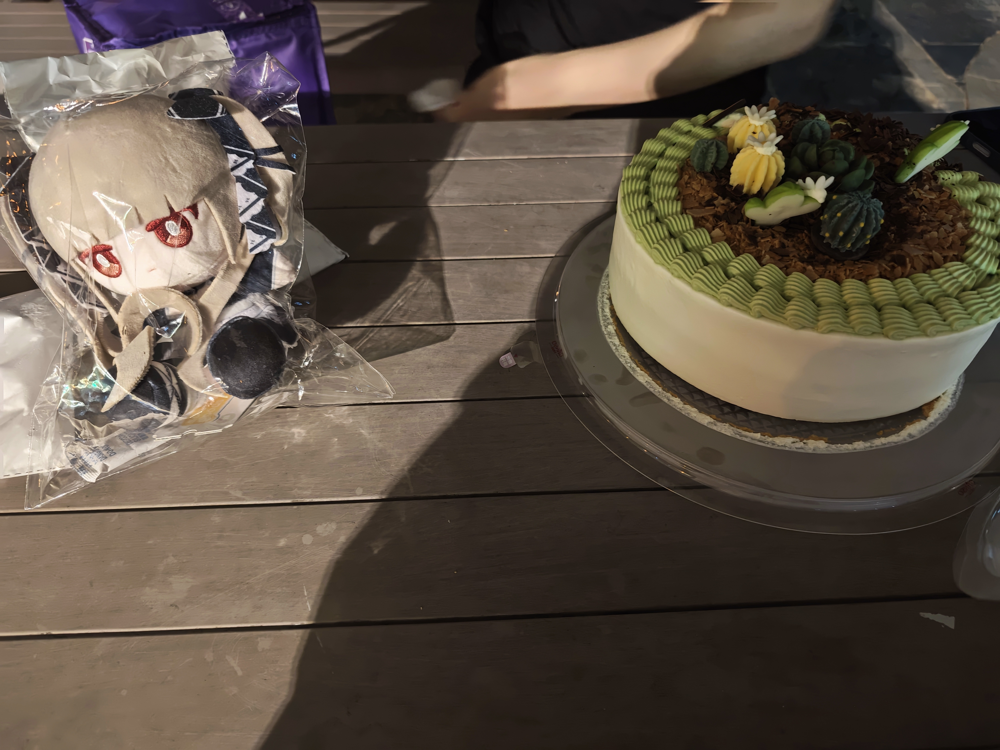

明天又要开始上课了，不过似乎也不是太差，至少比假期无所事事好一些。尽管是早八，但是是美丽的线代！好耶！

昨天被人邀请去生日聚会，然后感慨自己的胃口怎么这么小www。有种格格不入的感觉。

但是一码归一码，请吃饭没有让我们付钱显然是极度伟大的行为。但是说好的五点半在门口集合，自己孤零零撑着伞从五点二十等到五点五十……

也不是很想当面骂人，但是真的很想气不过直接回头自己吃饭然后哭一顿（x）。惦记着别人但是却被反过来以此为耗材……即便对方解释了在等人，但是这样一面要求别人一面自己变卦甚至中途再去买饮料……雨真的很冷啊QAQ

一言难尽。哭哭。不过看在请吃饭的前提下算了吧。

九月三号去仙林给高中同学过生日www，虽然不知道对面喜不喜欢但是还是买了个棉花娃娃的说。唉唉其实感觉自己真的不会挑礼物，很想站在对方的视角考虑对方会喜欢什么但是思来想去发现毫无头绪只好找自己和对方的共同话题然后小心翼翼挑一个了。

但是蛋糕很好吃，在仙林的烧烤摊边上听他聊着偷偷听的拓扑课，这才是夏天的大学的感觉哇。

xm仙林，宿舍底下就有麦麦和教超，好方便；然而鼓楼的宿舍地砖还在cos水雷。

于是想到宿舍里还有礼物并没有送出去，唉唉。

是啊，你不认识我，你为什么监控我的喜好，你送东西是为了什么 你好恶心啊。诸如此类的结局无论如何在她身上都是自洽的。对于一个缺乏内涵的愚蠢而丑陋的男大似乎再好不过了。

事情总是在异性身上变得复杂，虽然总有诸如你拿出跟朋友聊天的正常状态就好了的经验。

那喜欢到底是什么感情。所有的敏感的女孩子到底是什么。到底如何接触一个人。如果物质的给予都是物化她人的冒犯那么我们如何表达爱。如果爱情不是出于某种无法具化的意念那么这又是否叫做爱情。可悲的是我对于恋爱的执念仿佛就是用某种值得拿出来的优点将自己无理由的冲动合理化。也许我们必须承认并且正视这种无理由的感情。

教超正在播放反方向的钟。去年的九月我也沉浸在自我高潮的失恋中。出于给喜欢的高中女生发生日祝福反应平平无奇而断绝了她喜欢我的妄想。我知道交往是恋爱的开端。但是恋爱是复杂的命题。我总是可以找出一种方式证明这样的接触路径刻意而不完美，冒犯而荒诞，于是止步不前。于是她也从来不认识我。

她们有她们的社交，我承认我没有办法做到接触这些光芒万丈的我未知的女孩子。而我至始至终并没有什么吸引人的点，也并没有什么所谓的对于某件事情的专一与热爱，诚然我会在想，告白了总归可以不留遗憾，就如同你做梦后悔没有及时意识到这是做梦一样。但是失败真的可以就这样过去吗？并不吧，如果你真心喜欢上一个人的话，失恋并不是什么轻飘飘的事情吧，换而言之，持虚无主义的立场怎么可能会投入到恋爱中呢。

所以我不知道。什么永无止境的爱恋。

但是还有很多想要和别人一起做的事情。相互了解，一起去看鱼嘴的夕阳；一起手捧热可可走过冬天寂静的街道。我相信爱情就是某种天然纯粹的东西，所谓的物质性在爱情面前是精神的载体。物质的指向性在这一过程中是被淡化乃至抹除的。

十点半了，还是不要想这些不切实际的幻想了。明天还要早八，国庆假期前还要收拾行李，许多作业还要完成。反正上面的思绪大概会随着时间的推移慢慢变成不愿提起的过去，被写进未来的说说里，然后携带着，然后去看鱼嘴的夕阳，